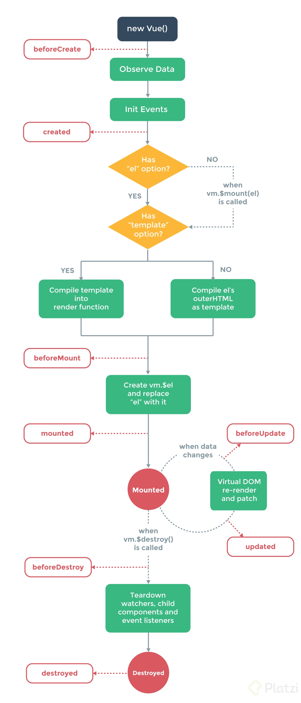

<div align="center">
  <h1>VUE </h1>
  <h2>Componentes y Composition API</h2>
</div>

<div style="margin-bottom:50px;"></div>

# Tabla de contenido
1. [Introducción a Vue CLI](#introducción-a-vue-cli)
2. [Estructura del proyecto](#estructura-del-proyecto)
3. [Componentes dinámicos](#componentes-dinámicos)
4. [Componentes asíncronos](#componentes-asíncronos)
5. [Transiciones](#transiciones)
6. [Teleports](#teleports)
7. [Ciclo de vida de los componentes](#ciclo-de-vida-de-los-componentes)
8. [Introducción a Composition API](#introducción-a-composition-api)
9. [Variables reactivas con ref y reactive](#variables-reactivas-con-ref-y-reactive)
10. [Watch](#watch)
11. [Computed](#computed)

<div style="margin-bottom:50px;"></div>

## Introducción a Vue CLI

> https://cli.vuejs.org/guide/installation.html

1. Instalar el CLI e inicializar proyecto con Vite
```bash
npm init vue@latest
```

2. Pasarnos a la carpeta del proyecto creado
```bash
cd project_name
```

3. Installamos npm
```bash
npm install
```

4. Inicializar el servidor
```bash
npm run dev
```
===

1. Instalar el CLI e inicializar proyecto con esta
```bash
npm install -g @vue/cli
```

2. Creamos el proyecto y le asignamos un nombre
```bash
vue create project_name
```

3. Pasarnos a la carpeta del proyecto creado
```bash
cd project_name
```
4. Inicializar el servidor
```bash
npm run serve
```

> Con ```vue ui``` se puede generar una interfaz para administrar todas las opciones del proyecto. Pero si se instalo con vite no funciona.


<div style="margin-bottom:50px;"></div>

## Estructura del proyecto

- **package.json** → Tiene nuestras dependencias, nuestros scripts que correremos con npm, nos prepara el terreno para poder trabajar.
- **README.md** → Podemos ver los distintos comandos para poder instalar dependencias, ejecutar el servidor de desarrollo, compilar para producción, eslinter, documentación oficial.
- **babel.config.js** → Configuración de babel. Es pequeño debido a que el equipo de desarrollo detrás de este proyecto ya se encargó de generar un preset de babel js, que ya lo tiene instalado nuestro proyecto.
- **.gitignore** → Ignorar archivos para no subirlos al repositorio.
- **.eslintrc.js** → Archivo para configurar eslint, este archivo agrega dos reglas, cuando se tenga activado el modo productivo se va a pedir que no se tengan console.log() y que no hayan debugger.
- **.browserslistrc** → Le indicamos con que versiones de navegadores debe trabajar.
- **node_modules** → En esta carpeta van a estar todos los módulos y dependencias que tiene nuestro proyecto.
- **public/** → Esta carpeta contiene un favicon.ico y un index.html, corre en un servidor de archivos estáticos.
- **src/** → La carpeta más importante, vamos a colocar todos los archivos en los que de verdad vamos a estar trabajando durante el desarrollo del proyecto. El archivo main.js es el archivo que va a encontrar el proyecto de webpack y lo va a utilizar para inicializar todo lo que tiene que ver con JavaScript en nuestro proyecto.
- **src/App.vue** → Componente principal, es en el que se creará la App en main.js.
- **src/assets** → Contendrá archivos estáticos, la diferencia entre src/assets y public/ es que assets se va a empaquetar junto con los archivos del proyecto, es decir, se va adjuntar todo el código javascript, css y html que se genere y también se van a incluir estos archivos estáticos en la carpeta dist (Creada con npm run build), lo que pasa con public es que esto no pasa a la carpeta dist, sin embargo, quedaría más del lado del servido, mientras que assets queda del lado del cliente.
- **src/components** → Esta carpeta contendrá todos los componentes hechos en Vue.js que utilizaremos en nuestro proyecto. Esta carpeta se puede estructurar como sea, se pueden tener subcarpetas, por ejemplo.

<div style="margin-bottom:50px;"></div>

## Componentes dinámicos

 Vue nos ofrece la posibilidad de generar componente dinamicos usando tag de vue ```<component>```

 ha este tag le defininimos la directriz ```v-bind``` para hacerlo reactivo, para complementar el v-bind se usa la palabra reservada de vue ```is```, este va tomar el valor del componente(nombre del componente definido en la propiedad components del componente(que lo contiene) y no el nombre con el que lo estamos importando.), osea que dependiendo del valor de is se muestra cierto componente u otro.

```javascript
 component :is="componente" />
```

Para que los estilos solo afecte al componente de interes y no de manera global a los otros componentes añadimos en el tag style la palabra reservada scoped

```html
<style scoped>
    css
</style>
```

<div style="margin-bottom:50px;"></div>

## Componentes asíncronos

Son aquellos componentes que quiero que carguen despues de que carguen los componentes principales e importantes de mi aplicacion. Para poder hacer esto debo importar de vue la propiedad defineAsyncComponent, antes del export default.

```javascript
import {defineAsyncComponent} from "vue";

const HelloWorld = defineAsyncComponent(()=> import("./components/HelloWorld.vue"))
```
### Ventajas
1. Que los proyectos carguen mucho más rapido
2. Que los proyectos solo carguen los componbentes que van a necesitar


<div style="margin-bottom:50px;"></div>

## Transiciones

> https://vuejs.org/guide/built-ins/transition.html

Permite aplicar css al momento de determinar si un elemento aparece o desaparece en pantalla.

Por ejemplo: Utilizamos la transición para agregar un desvanecimiento al clickear el botón que muestra (U oculta) el menú.

```javascript
<script>
import Menu from "./components/vMenu.vue";

export default {
  name: "App",
  components: { Menu },
  data() {
    return {
      show: false,
    };
  },
};
</script>

<template>
    <button @click="show = !show">Menu</button>
    <transition name="fade">
      <Menu v-show="show" />
    </transition>
</template>

<style >
.fade-enter-from,
.fade-leave-to{
  opacity:0;
}
.fade-enter-active,
.fade-leave-active{
  transition: opacity 0.3s ease;
}
</style>
```
Los modificadores que tiene una trancisión es:

**from:** cuando se inicia la transición

**to:** cuando se termina la transición

**active:** cuando se está ejecutando la transición

Para que funcione la transición, se debe agregar la clase .fade-enter-active o .fade-leave-active a los elementos que se quieren animar.

**fade-enter-active:** cuando se inicia la transición

**fade-leave-active:** cuando se termina la transición


<div style="margin-bottom:50px;"></div>

## Teleports

Componente que nos proporciona vue, que me permite inyectar secciones de componentes (templates) en otros elementos del DOM como el body. sintaxis ```<teleport>``` este debe envolver la seccion que quiero inyectar en algun elemento del DOM.

```javascript
<template>
  <div>
    <button @click="toggle">Modal</button>
    
    <teleport to="body">
        <div v-show="show" class="modal">
            <div class="modal-content">
                <p>Some text in the Modal..</p>
                <button @click="toggle" class="close">
                Cerrar
                </button>
            </div>
        </div>
    </teleport>
  </div>
</template>
```

<div style="margin-bottom:50px;"></div>

## Ciclo de vida de los componentes

> https://vuejs.org/api/options-lifecycle.html

Ciclo de vida de los componentes, también conocidos como lifecycle hooks son funciones que nos permiten definir acciones en cada etapa del ciclo de los componentes

1. beforeCreate.
2. created.
3. beforeMount.
4. mounted.
5. beforeUpdate.
6. updated.
7. beforeUnmount.
8. unmounted.

<div>
  <figure>
    
  </figure>
</div>

1. **beforeCreate** Se llama cuando la instancia se inicializa, después de que las props se resuelven y antes de procesar opciones como ```data()``` o ```computed```

```javascript
beforeCreate(){
  //código a ejecutar
}
```

2. **created** se llama cuando la instancia ha terminado de procesar todas las opciones relacionados con el estado, como lo son: datos reactivos, propiedades computadas, métodos y observadores, pero aún no comienza la fase de montado y la función ```$el``` aún no esta disponible.

```javascript
created(){
  //lógica a ejecutar
}
```

3. **beforeMount** se llama cuando el componente ha sido montado, pero no existen nodos en el DOM aún, pero están a punto de ser ejecutado el render el DOM por primera vez, no se llama su usamos renderizado del lado de servidor.

```javascript
beforeMount(){
  //lógica a ejecutar
}
```

4. **mounted** se llama cuando el componente ha sido montado, se considera montado cuando: todos sus componentes hijos síncronos han sido montados, no se incluyen los asíncronos o los que estén en modo suspendido ```<Suspense>``` , cuando su propio árbol del DOM ha sido creado e insertado en su contenedor padre. Tampoco es llamado durante renderizado del lado del servidor

```javascript
mounted(){
  //lógica a ejecutar
}
```

5. **beforeUpdate** se llama justo cuando el componente esta por actualizar su árbol del DOM, debido a un cambio reactivo. Este hook se puede usar para acceder al DOM justo cuando Vue esta por hacer un cambio.

```javascript
beforeUpdate(){
  //lógica a ejecutar
}
```

6. **updated** se llama justo cuando el componente ha sido actualizado por un cambio en su estado, En caso del padre su método se llamará cuando los métodos de sus hijos hayan terminado. Es importante tener cuidado si no somos precavidos podemos provocar ciclos de renderizado infinito.

```javascript
updated(){
  //lógica a ejecutar
}
```

7. **beforeUnmount** se llama justo cuando la instancia esta por salir del DOM, cuando usamos este hook la instancia que esta por salir aun es funcional

```javascript
beforeUnmount(){
  //lógica a ejecutar
}
```

8. **unmounted** se llama cuando el componente es desmontado, un componente se considera desmontado cuando: todos su hijos han sido desmontados y todos sus efectos reactivos se han detenido, este hook se utiliza cuando queremos limpiar de manera manual algunos efectos como cuentas regresivas, conexiones con el server o eventos del DOM.

```javascript
unmounted(){
  //lógica a ejecutar
}
```

> Todas se colocan dentro del objeto de configuración de la option API como una opción más.

```javascript
export default {
  name: "App",
  data() {
    return {
      text: 'Hello vue!',
    };
  },
  beforeCreate(){
    //código a ejecutar
  },
  created(){
    //código a ejecutar
  },
  mounted(){
    //código a ejecutar
  },
};
```

<div style="margin-bottom:50px;"></div>

## Introducción a Composition API

Se utiliza un método setup para declarar en su interior todos sus componentes con funciones.

```javascript
<template>
  <div>Hola</div>
</template>

<script>
    import { onMounted } from "vue";
    export default {
        setup() {
            onMounted(() => {
                console.log("mounted!");
            });
        },
    };
</script>
```


<div style="margin-bottom:50px;"></div>

## Variables reactivas con ref y reactive

***ref*** permite crear una referencia reactiva a un dato o una variable

```javascript
<script>
    import { ref } from "vue";
    
    export default {
        setup() {
            const text = ref("text");

            return { 
              text,
            }
        },
    };
</script>
```

> para leer el contenido usamos ```text.value```

> podemos utilizar javascript vanilla utilizando la nomenclatuira camelcase para nombres de mas de una palabra
```javascript
<template>
  <div>{{ counter }}</div>
</template>

<script>
    import { ref } from "vue";
    
    export default {
        setup() {
            const counter = ref(0);

            setInterval(() => counter.value++,500);
            
            return { 
              counter,
            }
        },
    };
</script>
```

***ref*** permite crear una referencia reactiva a un objecto

```javascript
<script>
    import { ref } from "vue";
    
    export default {
        setup() {
            const text = ref("text");

            return { 
              text,
            }
        },
    };
</script>
```

<div style="margin-bottom:50px;"></div>

## Watch

Watchers pero utilizando composition API

```watcher``` son funciones que permiten escuchar cuando una variable reactiva cambia su valor y se puede acceder a su valor antiguo y nuevo y hacer algo con ellos.

Si utilizamos reactive debe accederse atraves de función

```javascript
<script>
    import { reactive, watch } from "vue";
    
    export default {
        setup() {
            const obj = reactive({counter:0});

            setInterval(() => obj.counter++,500);

            watch( () => obj.counter, (value, old) => {
                console.log(value, old);
            });

            return { 
              obj,
            }
        },
    };
</script>
```

Si utilizamos ref solo es necesario la variable

```javascript
<script>
    import { watch, ref } from "vue";
    
    export default {
        setup() {
            const counter = ref(0);

            setInterval(() => counter.value++,500);

            watch(counter, (value, old) => {
                console.log(value, old);
            });
            return { 
              counter,
            }
        },
    };
</script>
```

<div style="margin-bottom:50px;"></div>

## Computed

Las funciones computadas ayudan a tener un template mas limpio, en un composition api se utilizan de la siguiente manera:

```javascript
<template>
  <div>{{ fullName }}</div>
</template>

<script>
    import { ref, computed } from "vue";
    
    export default {
        setup() {
            const firstName = ref('Kate');
            const lastName = ref('Castaño');

            const fullName = computed(() => {
                return `${firstName.value} ${lastName.value}`
            });
            return { 
                fullName
            }
        },
    };
</script>
```

